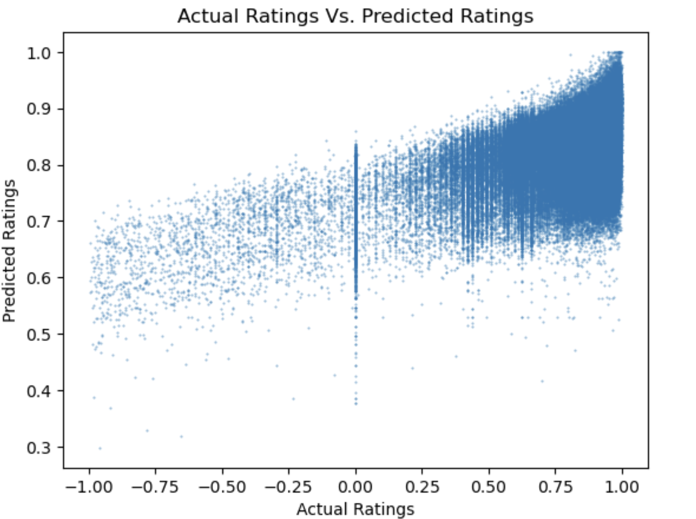

# Airbnb Recommender System
Author: [Scarlett Valentin](https://www.linkedin.com/in/scarlett-valentin/)

# Overview
The purpose of this project is to create a **collborative filtering recommender system** to recommend 3 Asheville, North Carolina Airbnb listings. This recommender system will help users find Airbnb listings that they will most likely enjoy based on the preferences of similar users, thus creating a more pleasure experience searching for listings. I used [two datasets from Airbnb](https://insideairbnb.com/get-the-data/), one of unique listings and one of unque reviews. I conducted a sentiment analysis using VADER to convert comment reviews to compound scores ranging from -1 to 1. I then created a final SVD model using `surprise` to recommend listings with an RMSE of 0.17. 

# Business Understanding
With an overabundance of information at our fingertips, decision-making can be quite overwhelming - especially when you are planning a vacation. Recommender systems help consumers find products tailored to their unique taste. In this project, **I will build a recommender system for Airbnb listings in Asheville, North Carolina**. 

In this project, I will complete the following 3 tasks:

1. Feature engineer a **sentiment analysis** column of compound scores from user reviews.
2. Create a **collaborative filtering model** to recommend 3 listings that an active user may like.
4. **Evaluate** the model to assess the efficacy of the recommendations.

# Data Understanding
The [data](https://insideairbnb.com/get-the-data/) has been extracted from Airbnb. This data includes information on Asheville, NC listings and was **last updated on June 21, 2024**. Two datasets were used in this project:
1. listings.csv.gz: **3031 entries of unique listings**. Each listing includes detailed information, including host information, price, availability, rooms, and reviews. This dataset will be trimmed to include only what will be listed in the recommendations.
2. reviews.csv.gz: **331718 entries of unique reviews**. This dataset includes the following columns - listing_id, id, date, reviewer_id, reviewer_name, comments. The reviews are listed as comments, not numerical ratings. 
To prepare the data for machine learning I use VADER SentimentIntensityAnalyzer to convert review comments to nuerical values (compound scores) in preparation for machine learning. Create a new column with these values. 

When visualizing the distribution of compound scores, it is revealed that the user reviews are overwhelmingly positive. 


# Modeling
I use the `surprise` library to create the recommender system. The baseline model is created using `BaselineOnly()`. I then iterate through various other models, including `SVD()`, `NMF()`, and `SlopeOne()`. The final model is an `SVD()` model with the following parameters: 
- n_factors=20
- n_epochs=10
- reg_all=0.1
- lr_all=0.01

# Evaluation
I evaluated the models using RMSE (Root Mean Squared Error). The final model has sn RMSE of 0.17. 


A few things are revealed through the scatterplot above of actual ratings versus predicted ratings. First, **the model does not predict any negative sentiments**. In fact, it seems the majority of the predictions fall between 0.7 and 1.0. This could be due to the lack of negative sentiments in the training data. Second, **the model appears to be inaccurate frequently when the actual rating is 0.0**. This is a neutral sentiment. Perhaps the model is having trouble interpreting a neutral sentiment and is classifying it as positive instead. Lastly, **the model appears to be accurate mostly between 0.5 and 1.0**. The points on the scatterplot are the most dende in this appear and supports the RMSE of 0.17.

# Conclusion
### Limitations
1. **New users do not have a baseline** on listing preferences, as they have not left any reviews.
2. The **reviews are overwhelmingly positive**. Therefore, it is difficult to determine what a user would dislike. 

### Next Steps
1. **Expand recommender system**: Initially, this recommender system should be sampled in a few more selected cities to test the efficacy and usefulness of the feature. It should then be expanded to include all cities in one recommender system.
2. **Incorporate additional factors of the listing into the recommendations**
3. **Cold Start Problem:** New users will not have any recommendations. Create a hybrid approach using content-based filtering to recommend 3 Airbnb listings to new users that do not have any review data. 


# For More Information
See the full analysis in the [Jupyter Notebook](/notebook.ipynb/) or review this [presentation](/presentation.pdf/). <br>
For questions, please feel free to contact me on [LinkedIn](https://www.linkedin.com/in/scarlett-valentin/). 


# Repository Structure


```

├── images
├── README.md
├── notebook.ipynb
└── presentation.pdf
```
